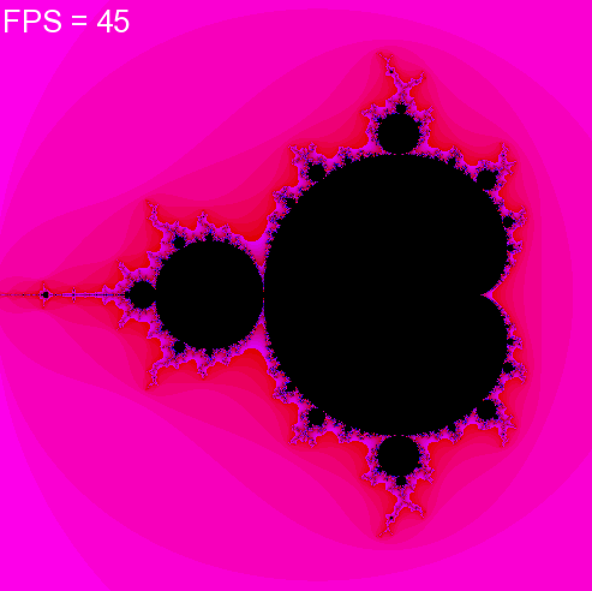

# Оптимизация построения множества Мандельброта
>*Представлена промежуточная версия. Проект в процессе разработки.*

Данный репозиторий содержит код, генерирующий изображение множества Мандельброта. Реализация создания изображения включает в себя три способа: обработка по одному пикселю, обработка по массивам пикселей из 8 элементов, обработка пикселей с помощью AVX инструкций.

## Визуальная демонстрация
Пример результата работы программы:


## Установка

### Клонирование репозитория
Клонируйте репозиторий:
```bash
git clone https://github.com/dmitrytjulkin/Mandelbrot-set.git
cd Mandelbrot-set
```

### Зависимости
Для получения на экране изображения необходимо скачать графическую библиотеку SFML:
```bash
sudo apt-get install libsfml-dev
```

## Запуск программы
Программа запускается с помощью команды `make`. Есть варианты запуска в зависимости от параметра `IMPL`. По умолчанию (`make`) или с аргументом 1 (`IMPL = 1`) компилируется режим обработки по одному пикселю. С аргументом 2 компилируется режим обработки по массивам пикселей (`IMPL = 2`). С аргументом 3 собирается программа с AVX инструкциями (`IMPL = 3`).

Чтобы запустить программу, после сборки нужно ввести относительный путь до исполняемого файла `mandelbrot`.

Пример сборки и запуска программы:
```bash
make IMPL = 3
./mandelbrot
```

## Данные
В таблице ниже приведены сравнения трех способов генерации изображения:
